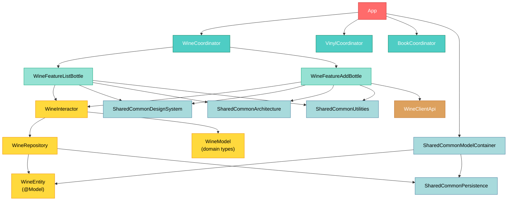

# Cellar Door

## Setup

- Install [mise](https://mise.jdx.dev/getting-started.html)
- Run `mise install` to install dependencies
- Run `tuist install` to fetch dependencies
- Run `tuist generate` to generate the Xcode project (it should open Xcode as well)
- Run the project

## Goal

The CellarDoor project aims to develop an iOS app to keep track of stuff I have: 
- Books
- Vinyl Records
- Wine Bottles
- Movies
- Board games
As a sample, here are the features envisioned for wine & vinyls:
1. vinyls: CRUD, add by OCRing, Stats/Charts (by genre, artist, listenings), timeline (by listenings, release date, entry date), export to textual format
2. wine: CRUD, add by OCRing, Stats/Charts (by cepage, region, tastings), Map of favored regions

It will be useful but will also serve as a portfolio ; hence, it must follow strictly best practices:
- SOLID principles
- TCA architecture
- Liquid glass
- Tuist
- Unit Tests (for business logic only)
- Accessibility (A RAAM compliance)
- Modularity

## Project structure 

The project is modular, with each module being a separate Tuist target. The modules are of the following types:
- `Common`: utilities and extensions shared across the app
- `Client`: API clients for dependencies (eg: networking, database...)
- `Entity`: persistence types (eg: SwiftData entities) mapped to domain types
- `Repository`: data access layer, interfaces to fetch/persist data from/to clients
- `Model`: domain types shared across a "mega feature" (or the whole app)
- `Interactor`: business logic layer, contains use cases manipulating domain types
- `Feature`: roughly a screen or a flow and a tree-based navigation between its components (ie: screens, sheets...)
- `Coordinator`: contains related features and hosts a **stack-based** navigation between them
- `App` (unique): root module which routes between mega features (eg: Wine, Vinyls, Books...)

Example for the Wine mega feature (this is one-to-one with what can be obtain using `tuist scaffold Mega --group Wine`):

Some clients help speed up build times by isolating dependencies to specific modules, such as:
- `SharedCommonDesignSystem`: contains UI components shared across multiple modules
- `SharedCommonUtilities`: contains utilities shared across multiple modules
- `SharedCommonDependencies`: contains swift-dependencies dependencies (the lib as well as shared primitives)
- `SharedCommonArchitecture`: contains TCA-related dependencies (and maybe some helpers)
- `SharedCommonPersistence`: contains persistence logic (eg: SwiftData setup) shared across multiple modules
- `SharedCommonModelContainer`: contains the shared SwiftData ModelContainer setup
More will likkely be added as the project grows.

## How to dev ?

### Create a new module

Make liberal use of the [Tuist templates](./Tuist/Templates/) to generate whatever module you may need.

### Add a dependency

Declare it in the [`Package.swift`](./Package.swift) file at the root of the project and add it to the relevant targets in their respective `Project.swift` files.

Then, run `tuist generate` to have Tuist fetch the dependencies and generate the Xcode project with them included.